## Containerized Web Application with PostgreSQL using Docker Compose and IPvlan
Project Assignment 1
Containerization and DevOps

This project demonstrates a containerized web application architecture using Docker.

The backend service is implemented using Node.js and Express, while PostgreSQL is used as the database. Both services are containerized and orchestrated using Docker Compose.

Networking is implemented using IPvlan, which assigns static IP addresses to containers inside a defined subnet.

<hr>

<h4 align="center"> Pre-requisite </h4>

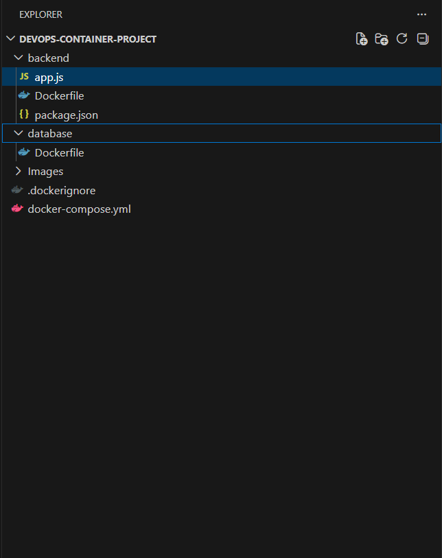

<hr>

**Step-1:-This screenshot shows the project folder structure containing two main directories: backend and database. The backend contains the Node.js application files while the database folder contains the PostgreSQL Dockerfile.**
```bash
tree /F
```
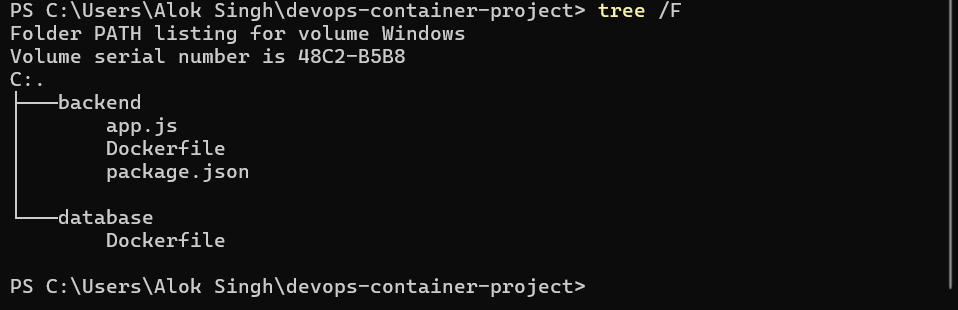


**Step-2:- This file contains the Node.js Express API that connects to PostgreSQL. It automatically creates the users table and provides endpoints for health check, inserting users, and retrieving users.

GET /health → check API status

POST /user → insert user into database

GET /users → fetch users from database**
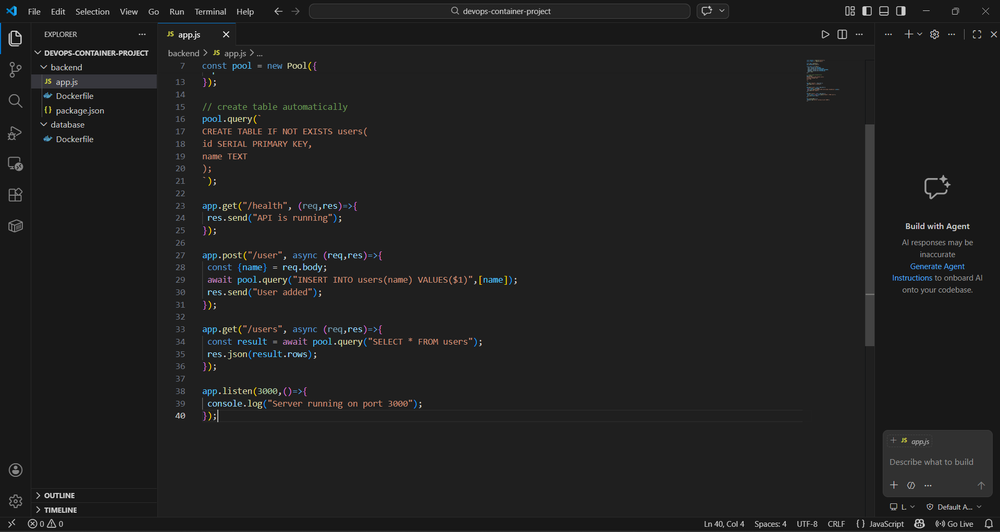


**Step-3:-The package.json file defines the Node.js project metadata and dependencies.
It includes Express for building the API server and pg for connecting to PostgreSQL.

Dependencies used:

express → Web framework

pg → PostgreSQL client for Node.js**
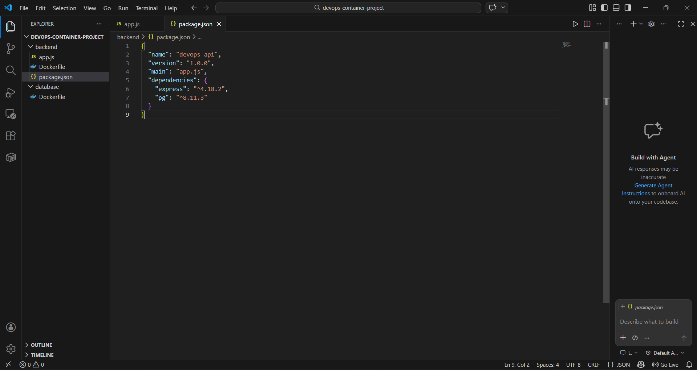


**Step-4:-This Dockerfile builds the backend API using a multi-stage build to create a smaller and optimized image.

Key steps performed:

Uses node:18-alpine as a lightweight base image

Installs dependencies in the build stage

Copies only required files to the runtime stage

Runs the application using a non-root user**
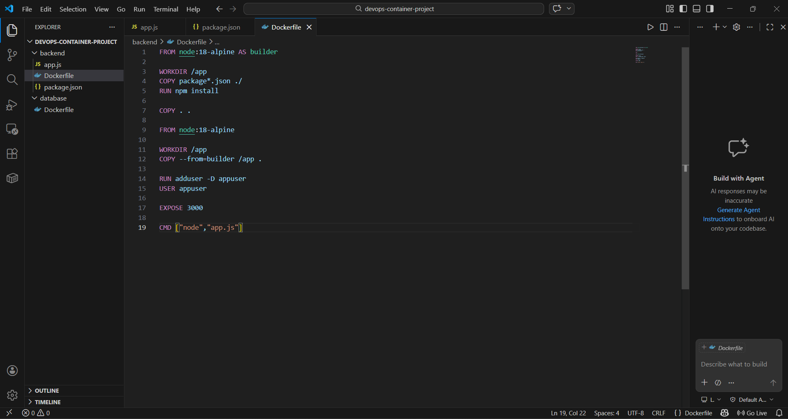


**Step-5:-This Dockerfile creates a custom PostgreSQL container image instead of using the default image directly.
It sets environment variables required for database initialization.

Configured variables:

POSTGRES_DB

POSTGRES_USER

POSTGRES_PASSWORD
**
```bash
```
FROM postgres:15-alpine
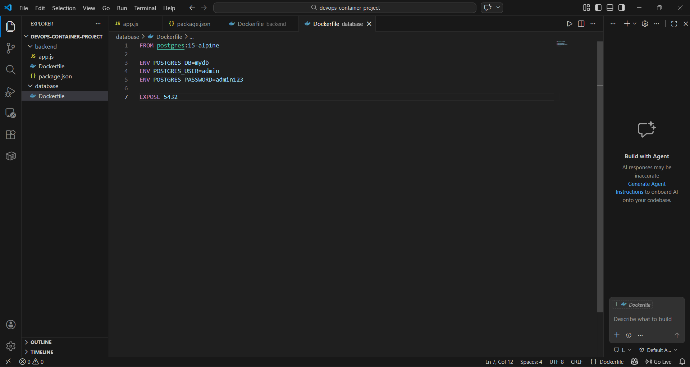


**Step-6:- The .dockerignore file is used to exclude unnecessary files from the Docker build context.
This helps reduce build time and prevents unwanted files like node_modules or .git from being copied into the image.**
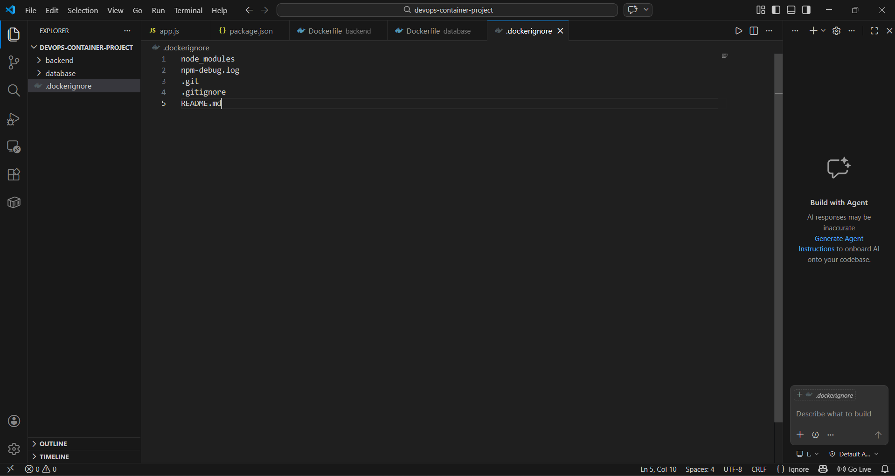


**Step-7:-Before building images, Docker Desktop must be running.
This screenshot confirms that the Docker engine is active and ready to run containers.**
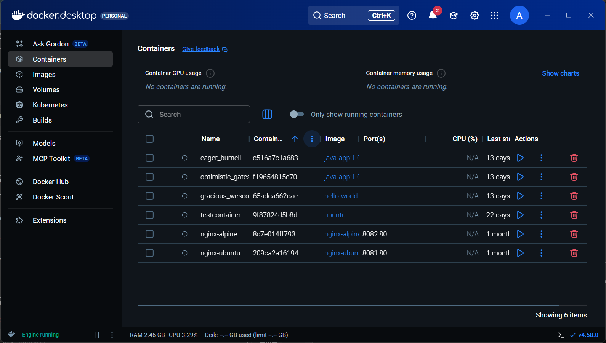


**Step-8:-The docker ps command is used to list all currently running containers.
At this stage no containers are running yet because the images have not been built.**
```bash
docker ps
```

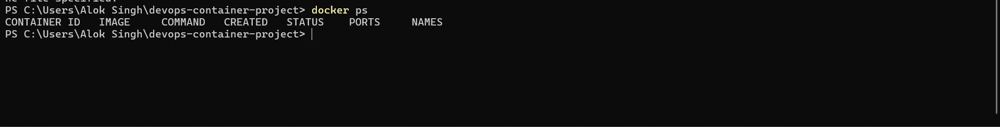


**Step-9:-The backend application image is built using the Dockerfile located inside the backend directory.
This command creates a Docker image named backend-image**
```bash
docker build -t backend-image ./backend
```
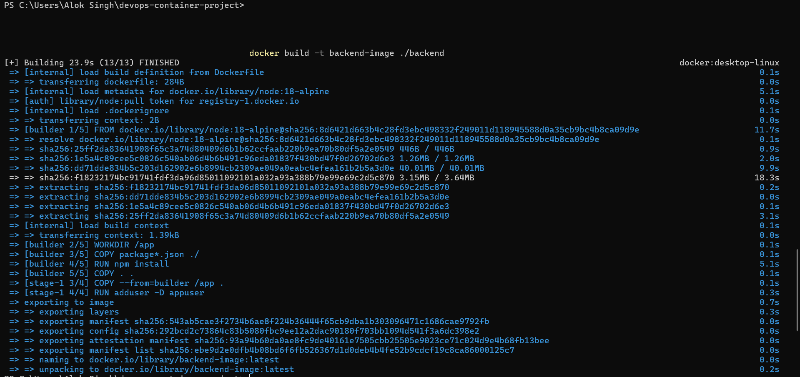


**Step-10:-Next, the PostgreSQL database image is built using the custom Dockerfile inside the database directory.
This creates a Docker image named postgres-image.**
```bash
docker build -t postgres-image ./database
```
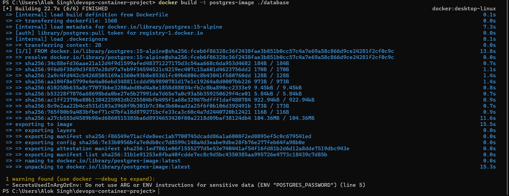


**Step-11:-After building both backend and database images, the docker images command is used to list all available Docker images.
This confirms that backend-image and postgres-image were successfully created.**
```bash
docker images
```
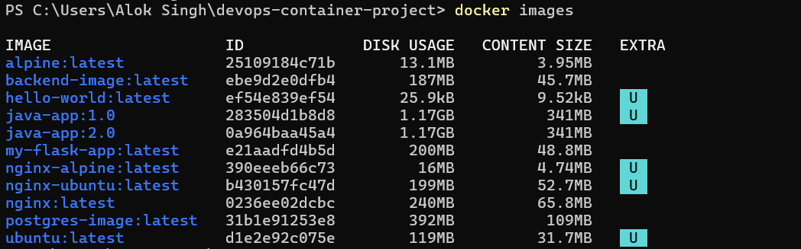


**Step-12:-Before creating a custom network, we check the currently available Docker networks.
By default Docker provides bridge, host, and none networks**
```bash
docker network ls
```
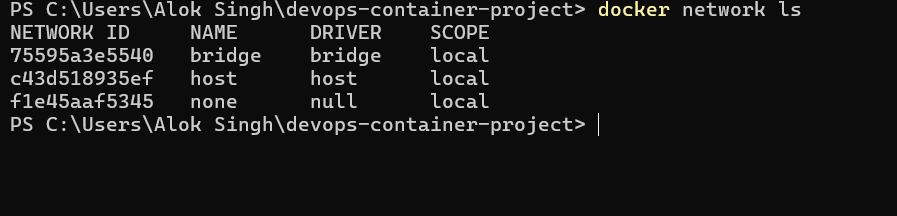


**Step-13:-A custom ipvlan network is created so containers can receive static IP addresses within the local network range.**
```bash
docker network create -d ipvlan \
--subnet=192.168.100.0/24 \
--gateway=192.168.100.1 \
-o parent=eth0 \
myipvlan
```
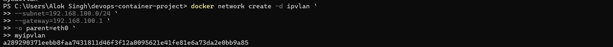


**Step-14:-After creating the network, the docker network ls command is used again to confirm that myipvlan network has been successfully created**
```bash
docker network ls
```
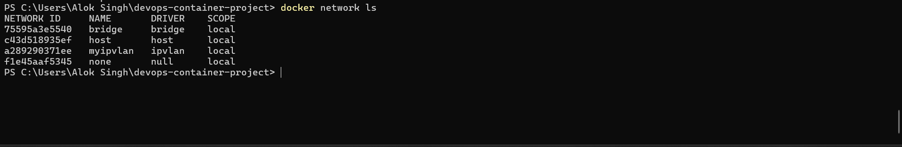


**Step-15:-The ipconfig command is used to check the host machine's network interface and IP configuration.
This helps determine the correct subnet and gateway when configuring Docker networking.**
```bash
ipconfig
```
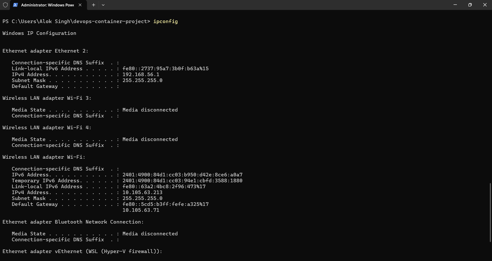


**Step-16:- The docker network inspect command is used to view detailed configuration of the created ipvlan network, including subnet, gateway, and parent interface**
```bash
docker network inspect myipvlan
```
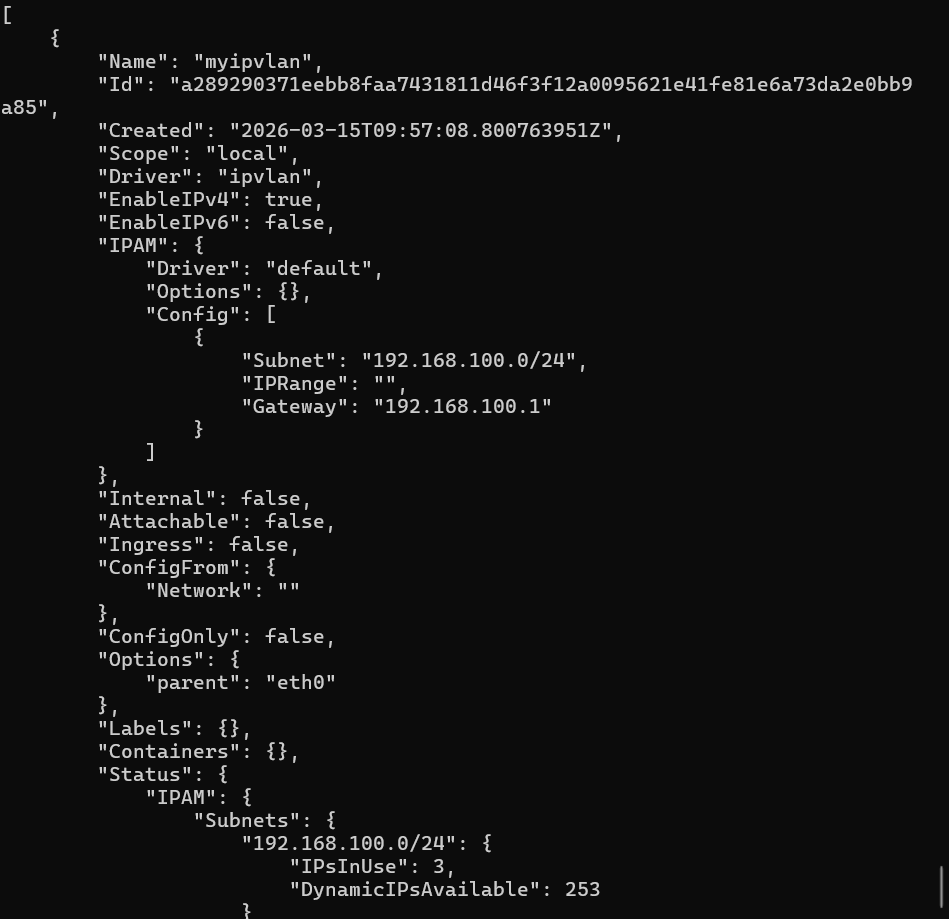


**Step-17:-The docker-compose.yml file is created to define and manage both services: backend API and PostgreSQL database.

Key configurations included:

Backend service using backend-image

Database service using postgres-image

Static IP assignment in the ipvlan network

Named volume for PostgreSQL data persistence

Environment variables for database connection**
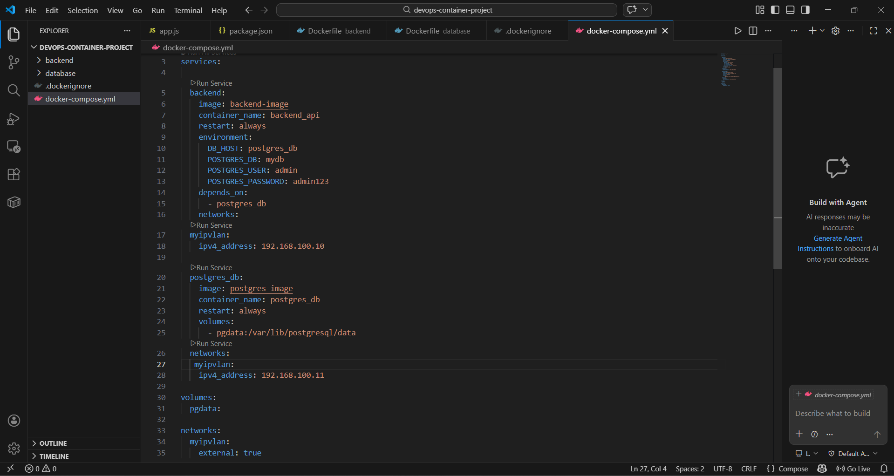


**Step-18:- The docker compose up -d command is used to start both services defined in the compose file in detached mode**
```bash
docker compose up -d
```
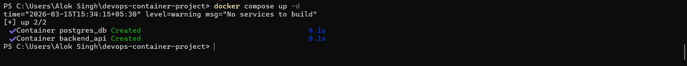


**Step-19:-After starting the services, the docker ps command is used to verify that the containers are running successfully.**
```bash
docker ps
```
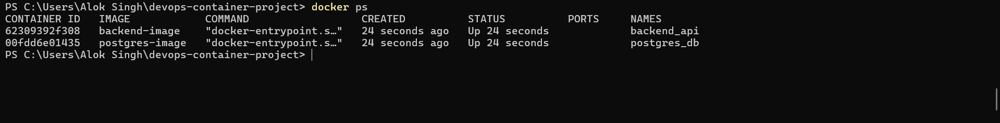


**Step-20:-The docker inspect command is used to check detailed information about the backend container, including the assigned static IP address in the ipvlan network**
```bash
docker inspect backend_api
```
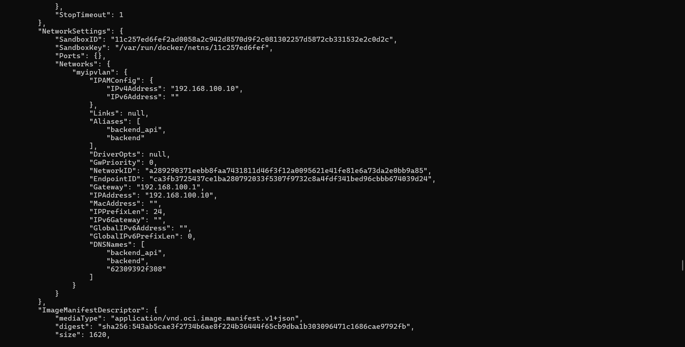


**Step-21:- The docker inspect command is used to verify the PostgreSQL container configuration and its assigned static IP address inside the ipvlan network**
```bash
docker inspect postgres_db
```
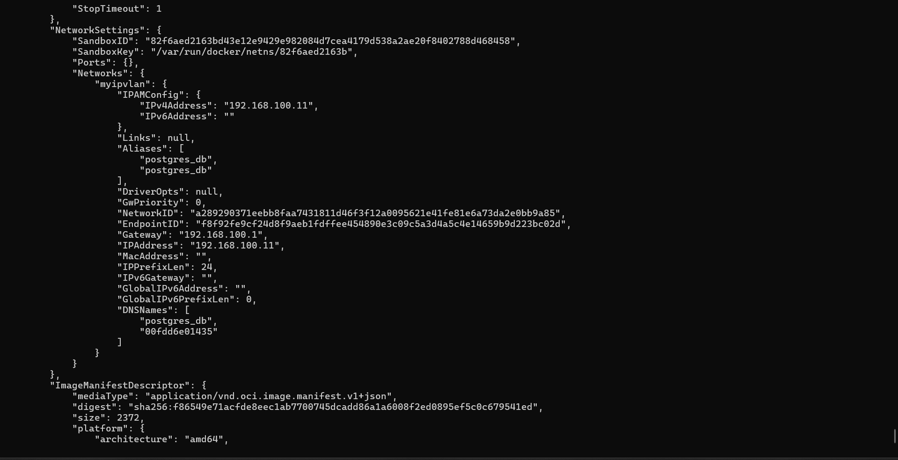

**Step-22:-To test the API internally, we access the backend container shell using the docker exec command**
```bash
docker exec -it backend_api sh
```
**Inside the container we verify that the backend API is running using the health endpoint.**
```bash
wget -qO- localhost:3000/health
```
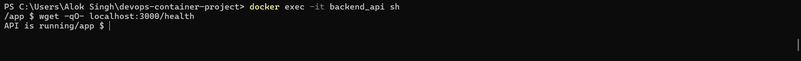

**Step-23:-Next, we test the POST API endpoint to insert a new user record into the PostgreSQL database.**
```bash
wget --post-data='{"name":"Arnav"}' \
--header="Content-Type: application/json" \
-qO- localhost:3000/user
```
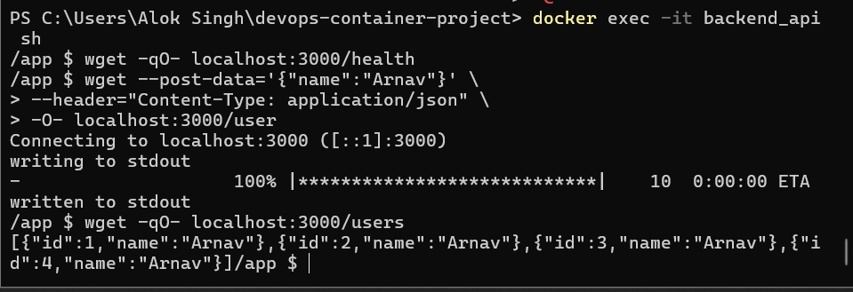

**Step-24:-The response confirms that the user was successfully inserted into the database.**
```bash
User added
```
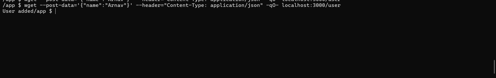

**Step-25:-Finally, we verify that the data has been stored successfully by calling the GET API endpoint.**
```bash
wget -qO- localhost:3000/users
```
**Example output**
```bash
[
 {"id":1,"name":"Arnav"},
 {"id":2,"name":"Arnav"},
 {"id":3,"name":"Arnav"}
]
```
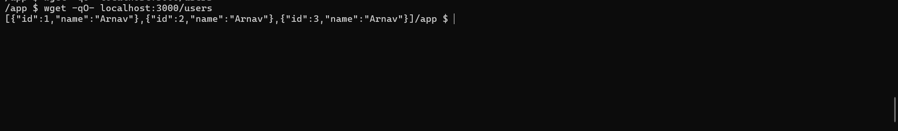

**Step-26:-After entering the backend container, we verify that the API service is running correctly using the health endpoint.**
```bash
wget -qO- localhost:3000/health
```
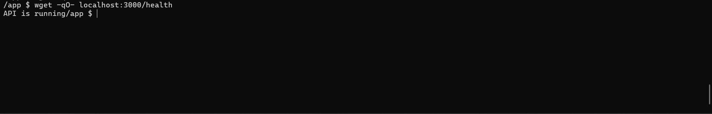

**Step-27:-To verify that the database data is persistent, we stop and restart the services using Docker Compose.**
```bash
docker compose down
docker compose up -d
```
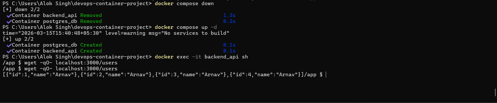

**Step-28:-Finally, we access the backend container again and fetch the stored users to confirm that the data still exists after the restart.**
```bash
docker exec -it backend_api sh
wget -qO- localhost:3000/users
```

<hr>

<h4 align="center"> Report </h4>

<hr>


**_Build Optimization Explanation_**

While building the Docker images for this project, several techniques were applied to make the containers lightweight, efficient, and secure.

One important optimization used is the multi-stage build in the backend Dockerfile. In this method, dependencies are installed in an initial build stage, and only the required application files are copied to the final runtime image. This approach removes unnecessary build tools and files from the final container, resulting in a smaller image size.

Another optimization is the use of a lightweight base image (node:18-alpine) instead of the standard Node.js image. Alpine Linux is much smaller in size, which helps reduce the overall image size, improves download speed, and allows containers to start faster.

A .dockerignore file is also included in the project. It prevents unnecessary files such as node_modules, .git, and log files from being sent to the Docker build context. This improves the build speed and keeps the final image clean.

Finally, the container runs with a non-root user. Running containers as a non-root user improves security because it limits the permissions available inside the container in case the application is compromised.


<br>

**_Network Design Diagram_**

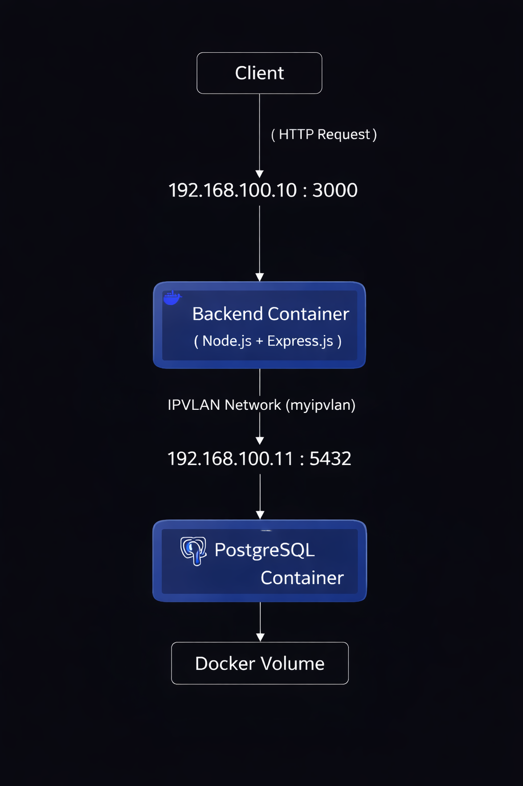


<br>


**_Image Size Comparison_**

The choice of base image significantly affects the final Docker image size.

node:18 → approximately 1.1 GB

node:18-alpine → approximately 180 MB

The Alpine-based image is considerably smaller than the standard Node.js image. Using a smaller base image helps reduce storage requirements, speeds up image transfers, and improves container startup performance.

Therefore, the node:18-alpine image was selected in this project to build a more efficient containerized application


**_Macvlan Vs IPvlan_**

| Feature       | MACVLAN                                  | IPVLAN                                |
| ------------- | ---------------------------------------- | ------------------------------------- |
| MAC Address   | Each container gets a unique MAC address | Containers share the host MAC address |
| Network Load  | Higher load on network switches          | Lower load on network switches        |
| Scalability   | Limited by switch MAC table              | More scalable                         |
| Typical Usage | Small environments                       | Large scale deployments               |
