Below is a complete `README.md` for **Experiment 11: Orchestration using Docker Swarm** (continuation of Experiment 6). It uses your PDF content and all screenshots (`1.png` … `14.png`). Place this file in your `Experiment-11/` folder and put the images in an `Images/` subdirectory.

```markdown
<h2 align="center">Experiment 11: Orchestration using Docker Swarm (Continuation of Experiment 6)</h2>

This experiment extends the WordPress + MySQL setup from **Experiment 6** by deploying it as a **Docker Swarm stack**. We explore orchestration features such as scaling, self‑healing, load balancing, and compare Swarm with plain Docker Compose.

---

## 📁 Table of Contents

- [Part A – Orchestration Concepts](#part-a--orchestration-concepts)
- [Part B – Practical Steps](#part-b--practical-steps)
  - [Task 1: Check Current State (No Swarm)](#task-1-check-current-state-no-swarm)
  - [Task 2: Initialize Docker Swarm](#task-2-initialize-docker-swarm)
  - [Task 3: Deploy as a Stack](#task-3-deploy-as-a-stack)
  - [Task 4: Verify the Deployment](#task-4-verify-the-deployment)
  - [Task 5: Access WordPress](#task-5-access-wordpress)
  - [Task 6: Scale the Application](#task-6-scale-the-application)
  - [Task 7: Test Self‑Healing](#task-7-test-self-healing)
  - [Task 8: Remove the Stack](#task-8-remove-the-stack)
- [Part C – Compose vs Swarm Analysis](#part-c--compose-vs-swarm-analysis)
- [Part D – Important Observations](#part-d--important-observations)
- [Learning Outcomes Check](#learning-outcomes-check)
- [Quick Reference Card](#quick-reference-card)
- [Cleanup](#cleanup)

---

## Part A – Orchestration Concepts

From Experiment 6, we know:

| Tool | What it does | Limitation |
|------|--------------|-------------|
| `docker run` | Runs a single container | Manual coordination |
| Docker Compose | Runs multiple containers together | Single machine, no auto‑healing |

**Orchestration** = automatic management of containers.  
It adds:
- **Scaling** – increase/decrease number of containers
- **Self‑healing** – restart failed containers automatically
- **Load balancing** – distribute traffic across containers
- **Multi‑host** – run containers across multiple machines

**Progression path:**  
`docker run` → Docker Compose → **Docker Swarm** → Kubernetes

This experiment focuses on moving from **Compose** → **Swarm**.

---

## Part B – Practical Steps

### Prerequisites

- Docker installed (with Swarm mode enabled)
- The `docker-compose.yml` file from Experiment 6 (WordPress + MySQL)

> If you don’t have the file, it is reproduced below.

### Task 1: Check Current State (No Swarm)

Ensure no containers from Experiment 6 are running:

```bash
docker compose down -v
docker ps
```

Expected: Only unrelated containers (if any).

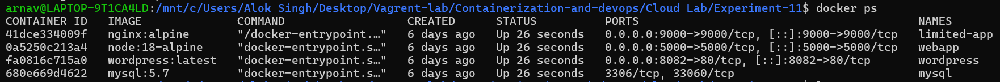

### Task 2: Initialize Docker Swarm

```bash
docker swarm init
```

This enables Swarm mode and makes the current node a manager.

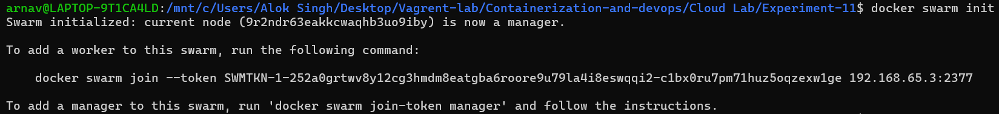

Verify Swarm is active:

```bash
docker node ls
```

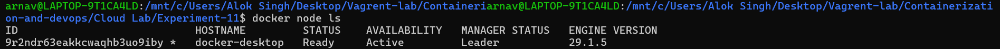

### Task 3: Deploy as a Stack

Use the same Compose file to deploy a **stack** (Swarm’s name for a group of services).

```bash
docker stack deploy -c docker-compose.yml wpstack
```

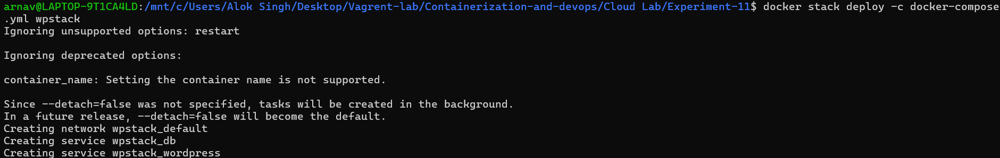

The Compose file (same as Experiment 6):

```yaml
version: '3.9'
services:
  db:
    image: mysql:5.7
    container_name: wordpress_db   # ignored by Swarm
    restart: always
    environment:
      MYSQL_ROOT_PASSWORD: rootpass
      MYSQL_DATABASE: wordpress
      MYSQL_USER: wpuser
      MYSQL_PASSWORD: wppass
    volumes:
      - db_data:/var/lib/mysql
  wordpress:
    image: wordpress:latest
    container_name: wordpress_app  # ignored by Swarm
    depends_on: [db]
    ports:
      - "8080:80"
    restart: always
    environment:
      WORDPRESS_DB_HOST: db:3306
      WORDPRESS_DB_USER: wpuser
      WORDPRESS_DB_PASSWORD: wppass
      WORDPRESS_DB_NAME: wordpress
    volumes:
      - wp_data:/var/www/html
volumes:
  db_data:
  wp_data:
```

> Swarm ignores `container_name` and `restart` (it handles restart policies differently) but accepts the rest.

### Task 4: Verify the Deployment

List all services in the stack:

```bash
docker service ls
```

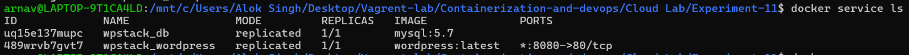

See detailed tasks (containers) for a service:

```bash
docker service ps wpstack_wordpress
```

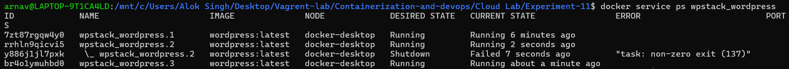

See all running containers:

```bash
docker ps | grep wordpress
```

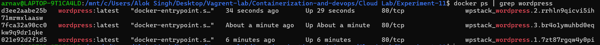

Observation: Containers are now named by Swarm (e.g., `wpstack_wordpress.1.xxx`).

### Task 5: Access WordPress

Open your browser: **http://localhost:8080**

You will see the WordPress installation screen (same as Experiment 6).

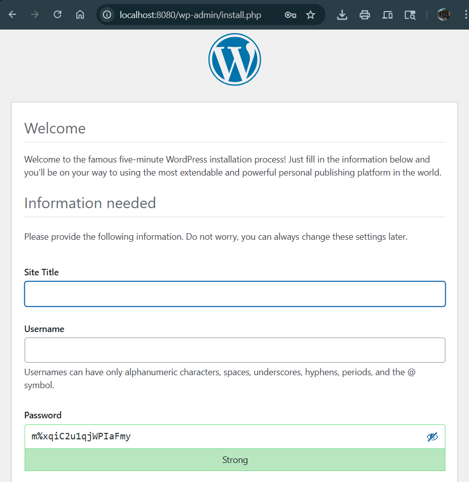

After completing the installation, you get the success page.

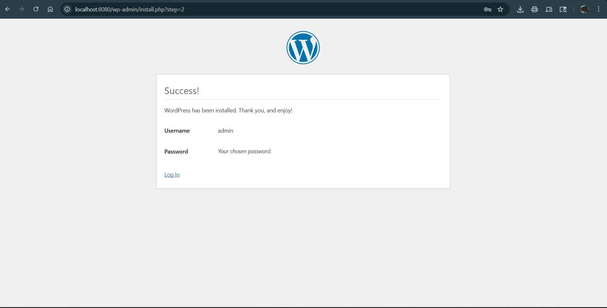

### Task 6: Scale the Application

This is where Swarm shines: one command scales WordPress from 1 to 3 replicas.

```bash
docker service scale wpstack_wordpress=3
```

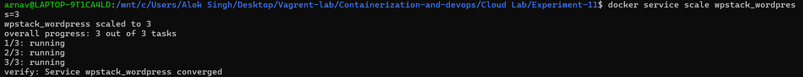

Verify the new replica count:

```bash
docker service ls
```

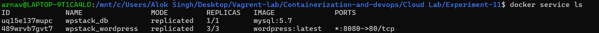

Check that 3 WordPress containers are running:

```bash
docker ps | grep wordpress
```

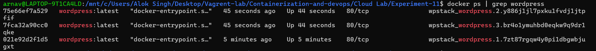

**How do 3 containers share port 8080?**  
Swarm creates an internal **load balancer**. All traffic to `localhost:8080` is distributed automatically across the three containers – no port conflicts.

### Task 7: Test Self‑Healing

Swarm automatically replaces failed containers.

1. Find a WordPress container ID:
   ```bash
   docker ps | grep wordpress
   ```
2. Kill it (simulate a crash):
   ```bash
   docker kill <container-id>
   ```
3. Watch Swarm recreate it:
   ```bash
   docker service ps wpstack_wordpress
   ```

You will see the killed container marked as `Shutdown Failed` and a new container created automatically.


4. Verify still 3 containers running:
   ```bash
   docker ps | grep wordpress
   ```

Swarm fixed it without any manual intervention!

### Task 8: Remove the Stack

Clean up everything:

```bash
docker stack rm wpstack
```

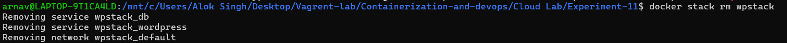

Verify removal:

```bash
docker service ls
docker ps
```

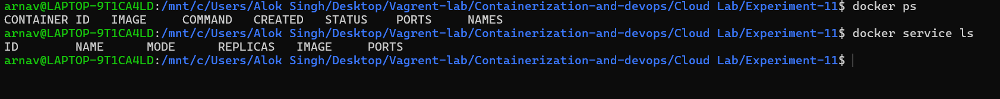

> Volumes persist unless you delete them manually with `docker volume prune`.

---

## Part C – Compose vs Swarm Analysis

| Feature | Docker Compose | Docker Swarm |
|---------|----------------|---------------|
| **Scope** | Single host only | Multi‑node cluster |
| **Scaling** | `--scale` (basic, no balancing) | `docker service scale` (built‑in) |
| **Load Balancing** | No (port conflicts when scaling) | Yes (internal ingress network) |
| **Self‑Healing** | No (only `restart: always` on same host) | Yes (re‑creates failed tasks) |
| **Rolling Updates** | No | Yes (zero downtime) |
| **Service Discovery** | Via container names | Via DNS + Virtual IP |
| **Use Case** | Development, testing | Simple production clusters |
| **Complexity** | Low | Medium |

### When to Use What?

- **Docker Compose** → local development, CI pipelines, single‑host demos.
- **Docker Swarm** → small‑ to medium‑scale production, easy scaling, self‑healing needs.
- **Kubernetes** → large‑scale, complex microservices, advanced scheduling.

---

## Part D – Important Observations

### Observation 1: Compose File Reuse
The **same `docker-compose.yml`** works for both Compose and Swarm. Swarm extends Compose, it does not replace it.

### Observation 2: Containers vs Services
- **Container** – a single running instance.
- **Service** – a definition of how to run containers (image, replicas, ports, etc.).  
  In Swarm, you manage **services**, not individual containers.

### Observation 3: The Port Mystery Solved
- In Compose, scaling WordPress to 3 would fail because all three would try to bind to host port `8080`.
- In Swarm, the **load balancer** listens once on `8080` and distributes traffic internally – no conflicts.

---

## Learning Outcomes Check

Answer these questions in your lab book:

1. Why is Compose not enough for production?
2. What does `docker stack deploy` do differently than `docker compose up`?
3. How does Swarm achieve self‑healing?
4. What happens if you run `docker kill` on a container managed by Swarm?
5. Can you use the same Compose file for both development (Compose) and production (Swarm)? Why?

---

## Quick Reference Card

```bash
# Initialize Swarm
docker swarm init

# Deploy a stack
docker stack deploy -c docker-compose.yml <stack-name>

# List services
docker service ls

# Scale a service
docker service scale <stack-name_service-name>=<replicas>

# See tasks of a service
docker service ps <service-name>

# Remove a stack
docker stack rm <stack-name>

# Leave Swarm (if needed)
docker swarm leave --force
```

---

## Cleanup

To fully clean up after the experiment:

```bash
docker stack rm wpstack
docker swarm leave --force
docker volume prune -f
```

---

## Summary

| You started with | You can now do |
|----------------|----------------|
| Single container (`docker run`) | Multi‑container (Compose) |
| Manual scaling | One‑command scaling (`scale`) |
| Manual recovery | Automatic self‑healing |
| Single host | Multi‑host cluster ready |

> **Final takeaway:** Compose *defines* the application. Swarm *runs it reliably*.

---

*This experiment shows how Docker Swarm adds production‑grade orchestration (scaling, self‑healing, load balancing) to the same Compose file used for local development.*

**Author:** Arnav  
**Date:** May 1, 2026
```

**Instructions for GitHub:**
1. Inside `Experiment-11/`, create an `Images/` folder.
2. Copy all screenshot files (`1.png` … `14.png`) into `Images/`.
3. Also place the `docker-compose.yml` file (the same one from Experiment 6) in the directory.
4. Push the `README.md` and the project files.

Your Experiment 11 documentation is now complete and ready for GitHub.