# Experiment 12: Study and Analyse Container Orchestration using Kubernetes

<hr>

<h4 align="center">Study and Analyse Container Orchestration using Kubernetes</h4>

<hr>

## Objective
Learn why Kubernetes is used, its basic concepts, and how to deploy, scale, and fix apps using Kubernetes commands.

## Why Kubernetes over Docker Swarm?

| Reason | Explanation |
|--------|-------------|
| Industry standard | Most companies use Kubernetes |
| Powerful scheduling | Automatically decides where to run your app |
| Large ecosystem | Many tools and plugins available |
| Cloud-native support | Works on AWS, Google Cloud, Azure, etc. |

## Core Kubernetes Concepts

| Docker Concept | Kubernetes Equivalent | What it means |
|----------------|----------------------|----------------|
| Container | Pod | A pod is a group of one or more containers. Smallest unit in K8s. |

## Hands-On Lab (Using Minikube)

### Prerequisites
- `kubectl` and a running Minikube cluster installed.

Start Minikube:
```bash
minikube start
```
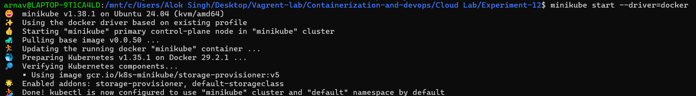

Check cluster:
```bash
kubectl get nodes
```
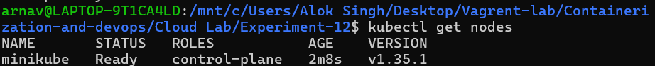

### Task 1: Create a Deployment

Create `wordpress-deployment.yaml`:
```yaml
apiVersion: apps/v1
kind: Deployment
metadata:
  name: wordpress
spec:
  replicas: 2
  selector:
    matchLabels:
      app: wordpress
  template:
    metadata:
      labels:
        app: wordpress
    spec:
      containers:
      - name: wordpress
        image: wordpress:latest
        ports:
        - containerPort: 80
```
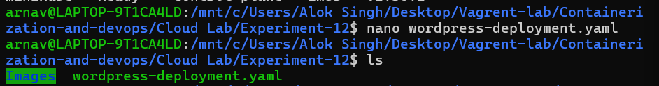

Apply:
```bash
kubectl apply -f wordpress-deployment.yaml
```
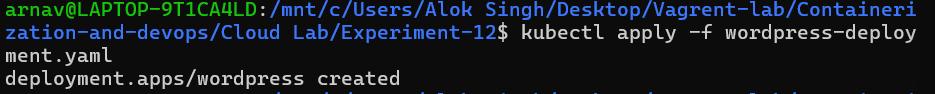

Check pods:
```bash
kubectl get pods
```
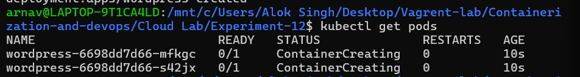

### Task 2: Expose as a Service

Create `wordpress-service.yaml`:
```yaml
apiVersion: v1
kind: Service
metadata:
  name: wordpress-service
spec:
  type: NodePort
  selector:
    app: wordpress
  ports:
    - port: 80
      targetPort: 80
      nodePort: 30007
```
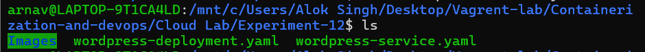

Apply:
```bash
kubectl apply -f wordpress-service.yaml
```

### Task 3: Verify

Check service:
```bash
kubectl get svc
```
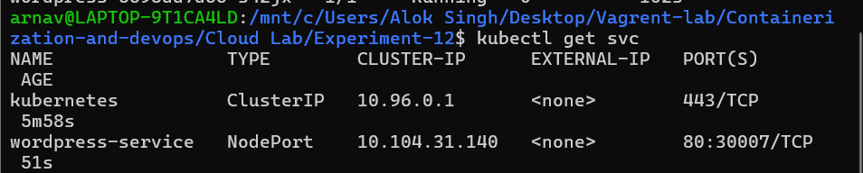

Get access URL:
```bash
minikube service wordpress-service --url
```
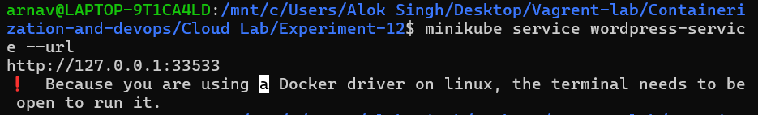

Open in browser → WordPress installation screen.

### Task 4: Scale the Deployment

Scale from 2 to 4 replicas:
```bash
kubectl scale deployment wordpress --replicas=4
```
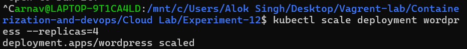

Verify:
```bash
kubectl get pods
```
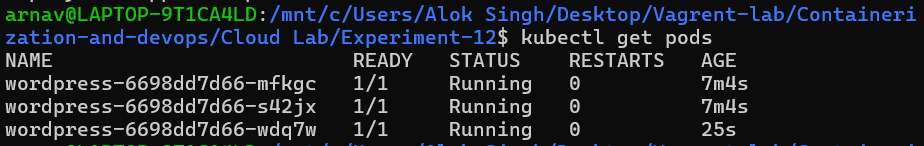

### Task 5: Self-Healing Demonstration

Delete one pod manually:
```bash
kubectl delete pod <pod-name>
```
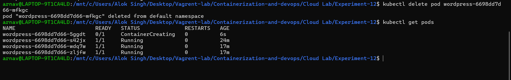

Kubernetes automatically recreates the pod to maintain desired count.

## Swarm vs Kubernetes Comparison

| Feature | Docker Swarm | Kubernetes |
|---------|--------------|------------|
| Setup | Very easy | More complex |
| Scaling | Basic | Advanced |
| Ecosystem | Small | Huge |
| Industry use | Rare | Standard |

## Cheat Sheet

| Command | Purpose |
|---------|---------|
| `kubectl apply -f <file>` | Create/update resources |
| `kubectl get pods` | List pods |
| `kubectl get svc` | List services |
| `kubectl scale deployment <name> --replicas=N` | Scale replicas |
| `kubectl delete pod <pod-name>` | Delete a pod |
| `minikube service <service-name> --url` | Get access URL |

## Cleanup

```bash
kubectl delete -f wordpress-service.yaml
kubectl delete -f wordpress-deployment.yaml
minikube stop   # optional
```

---
**End of Experiment**
```

**Instructions:**
- Place all images (`1.png` … `11.png`) inside an `Images/` folder in `Experiment-12/`.
- Save this as `README.md`.
- Push to GitHub.