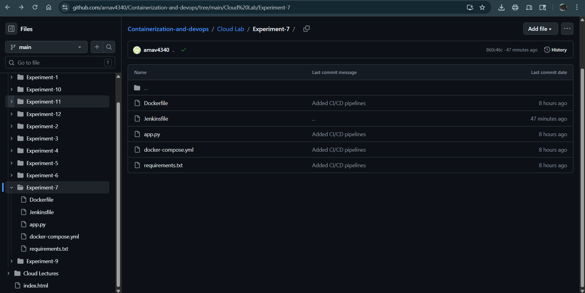
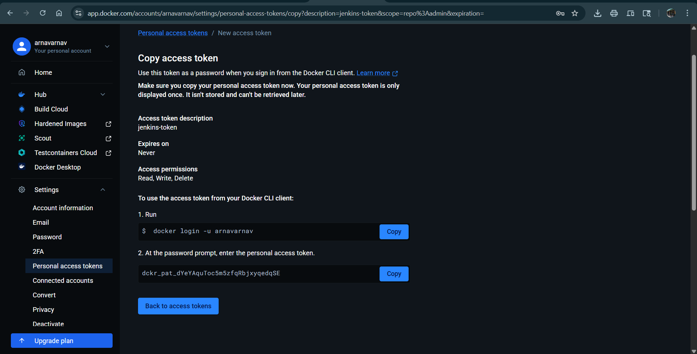
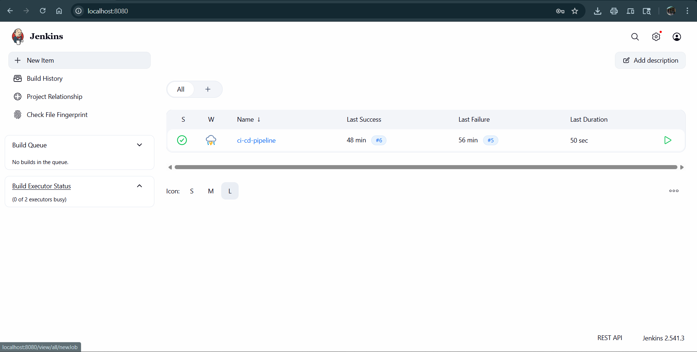
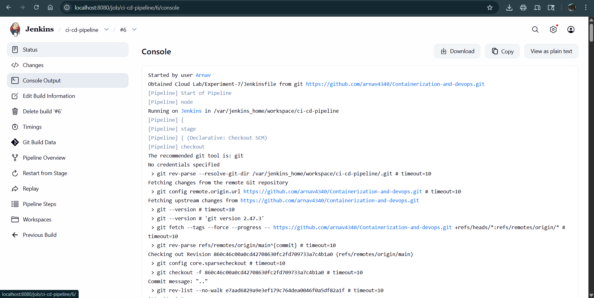
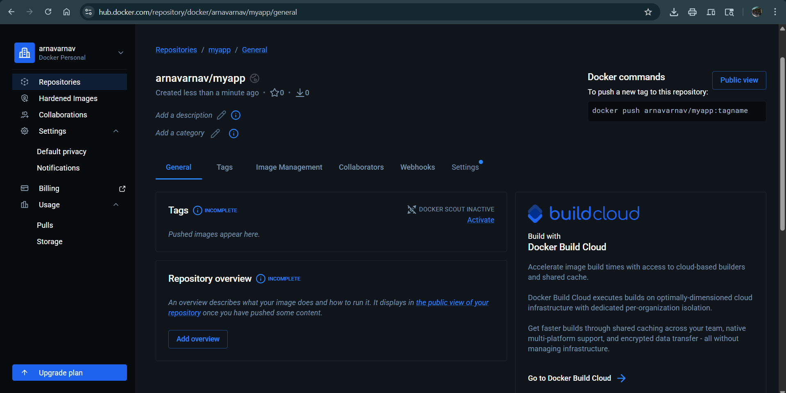
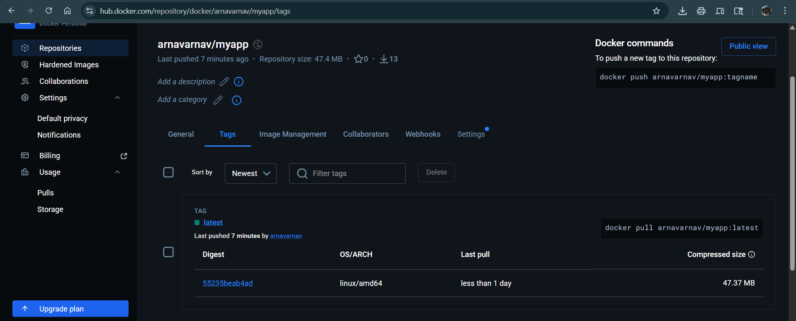
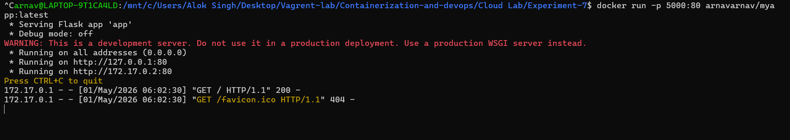
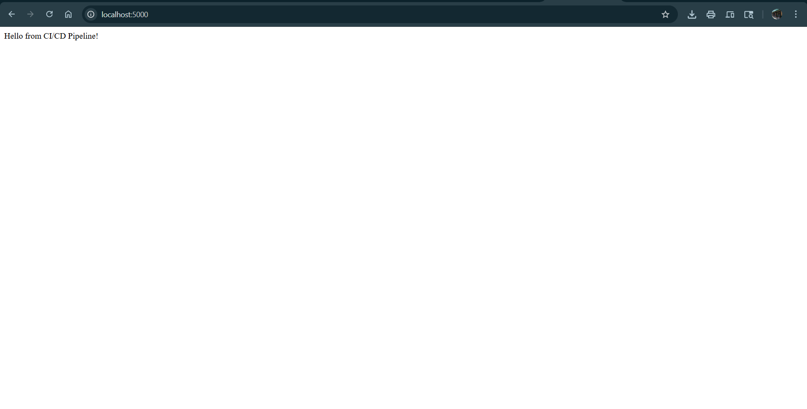
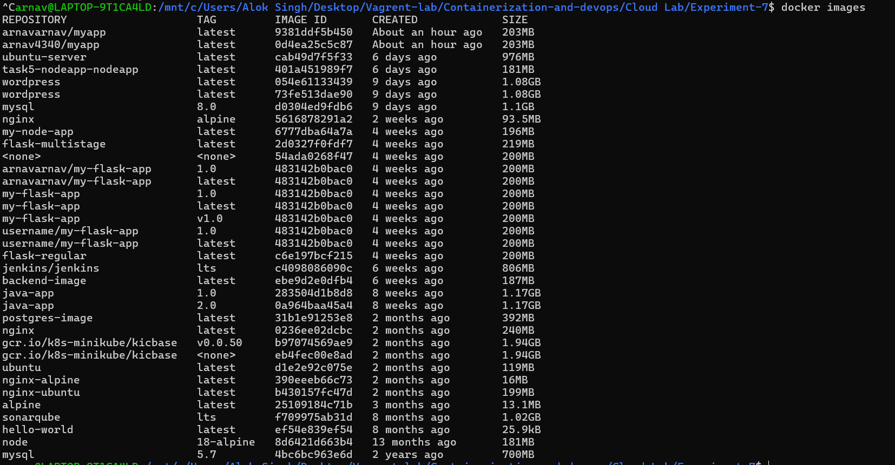

Here is the `README.md` for **Experiment 7: CI/CD using Jenkins, GitHub and Docker Hub**. It follows your PDF and includes all images (`1.png` to `10.png`). Place the images in an `Images/` folder.

```markdown
# Experiment 7: CI/CD using Jenkins, GitHub and Docker Hub

## 1. Aim
To design and implement a complete CI/CD pipeline using Jenkins, integrating source code from GitHub, and building & pushing Docker images to Docker Hub.

## 2. Objectives
- Understand CI/CD workflow using Jenkins (GUI-based tool)
- Create a structured GitHub repository with application + Jenkinsfile
- Build Docker images from source code
- Securely store Docker Hub credentials in Jenkins
- Automate build & push process using webhook triggers
- Use same host (Docker) as Jenkins agent

## 3. Theory

**Jenkins** – Web‑based automation server for building, testing, and deploying software. Provides dashboard, plugin ecosystem, and Pipeline as Code using `Jenkinsfile`.

**CI/CD** – Continuous Integration (automated build/test after each commit) + Continuous Deployment (automatic delivery of built artifacts, e.g., Docker images).

**Workflow:** Developer → GitHub → Webhook → Jenkins → Build → Docker Hub

## 4. Prerequisites
- Docker & Docker Compose installed
- GitHub account
- Docker Hub account
- Basic Linux command knowledge

## 5. Part A: GitHub Repository Setup

### 5.1 Create Repository
Create a repository on GitHub (e.g., `my-app`).

### 5.2 Project Structure
```
my-app/
├── app.py
├── requirements.txt
├── Dockerfile
└── Jenkinsfile
```

### 5.3 Application Code (`app.py`)
```python
from flask import Flask
app = Flask(__name__)

@app.route("/")
def home():
    return "Hello from CI/CD Pipeline!"

app.run(host="0.0.0.0", port=80)
```

### 5.4 `Dockerfile`
```dockerfile
FROM python:3.10-slim
WORKDIR /app
COPY requirements.txt .
RUN pip install -r requirements.txt
COPY app.py .
EXPOSE 80
CMD ["python", "app.py"]
```

### 5.5 `Jenkinsfile` (Pipeline Definition)
```groovy
pipeline {
    agent any
    environment {
        IMAGE_NAME = "arnavarnav/myapp"   # replace with your Docker Hub username
    }
    stages {
        stage('Clone Source') {
            steps {
                git 'https://github.com/arnav4340/Containerization-and-devops.git'
            }
        }
        stage('Build Docker Image') {
            steps {
                sh 'docker build -t $IMAGE_NAME:latest .'
            }
        }
        stage('Login to Docker Hub') {
            steps {
                withCredentials([string(credentialsId: 'dockerhub-token', variable: 'DOCKER_TOKEN')]) {
                    sh 'echo $DOCKER_TOKEN | docker login -u arnavarnav --password-stdin'
                }
            }
        }
        stage('Push to Docker Hub') {
            steps {
                sh 'docker push $IMAGE_NAME:latest'
            }
        }
    }
}
```



## 6. Part B: Jenkins Setup using Docker

### 6.1 Create `docker-compose.yml`
```yaml
version: '3.8'
services:
  jenkins:
    image: jenkins/jenkins:lts
    container_name: jenkins
    restart: always
    ports:
      - "8080:8080"
      - "50000:50000"
    volumes:
      - jenkins_home:/var/jenkins_home
      - /var/run/docker.sock:/var/run/docker.sock
    user: root
volumes:
  jenkins_home:
```

### 6.2 Start Jenkins
```bash
docker-compose up -d
```
Access: `http://localhost:8080`

### 6.3 Unlock Jenkins
```bash
docker exec -it jenkins cat /var/jenkins_home/secrets/initialAdminPassword
```

### 6.4 Initial Setup
- Install suggested plugins
- Create admin user

## 7. Part C: Jenkins Configuration

### 7.1 Add Docker Hub Credentials
- **Path:** Manage Jenkins → Credentials → Add Credentials
- **Type:** Secret Text
- **ID:** `dockerhub-token`
- **Value:** Docker Hub Access Token (generated from Docker Hub → Account Settings → Security → New Access Token)



### 7.2 Create Pipeline Job
1. New Item → Pipeline → Name: `ci-cd-pipeline`
2. Configure:
   - **Pipeline script from SCM**
   - **SCM:** Git
   - **Repository URL:** `https://github.com/arnav4340/Containerization-and-devops.git`
   - **Script Path:** `Cloud Lab/Experiment-7/Jenkinsfile`



## 8. Part D: GitHub Webhook Integration

On GitHub repository:
- Settings → Webhooks → Add Webhook
- **Payload URL:** `http://<your-server-ip>:8080/github-webhook/`
- **Events:** Push events

## 9. Part E: Execution Flow (Stage-wise)

1. **Code Push** – Developer pushes code to GitHub
2. **Webhook Trigger** – GitHub sends event to Jenkins
3. **Jenkins Pipeline:**
   - *Clone* – pulls latest code
   - *Build* – `docker build` using Dockerfile
   - *Login* – logs into Docker Hub using stored token
   - *Push* – pushes image to Docker Hub
4. **Artifact Ready** – Docker image available globally



## 10. Role of Same Host Agent
Jenkins runs inside Docker, and the Docker socket (`/var/run/docker.sock`) is mounted. This allows Jenkins to directly control the host Docker daemon – building and pushing images without a separate agent.

## 11. Observations
- Jenkins GUI simplifies CI/CD management
- GitHub acts as source + pipeline definition
- Docker ensures consistent builds
- Webhook enables automation

## 12. Result

Successfully implemented a complete CI/CD pipeline:
- Source code and pipeline maintained in GitHub
- Jenkins automatically detects changes
- Docker image is built on host agent
- Image is securely pushed to Docker Hub




Running the image locally:
```bash
docker run -p 5000:80 arnavarnav/myapp:latest
```



List of built images:
```bash
docker images
```


## 13. Viva Questions

1. What is the role of Jenkinsfile?
2. How does Jenkins integrate with GitHub?
3. Why is Docker used in CI/CD?
4. What is a webhook?
5. Why store Docker Hub token in Jenkins credentials?
6. What is the benefit of using same host as agent?

## 14. Key Notes
- Jenkins is GUI-based but pipeline is code-driven
- Always use credentials store (never hardcode secrets)
- Webhook makes CI/CD fully automatic
- This setup is ideal for learning and small deployments

## Understanding Jenkins Pipeline Syntax

**Basic structure:**
```groovy
pipeline {
    agent any
    stages {
        stage('Name') {
            steps {
                // commands
            }
        }
    }
}
```

**Common steps:**
- `git 'url'` – clones repository
- `sh 'command'` – runs shell command
- `echo "message"` – prints to console

**`withCredentials` – secure secret handling:**
```groovy
withCredentials([string(credentialsId: 'dockerhub-token', variable: 'DOCKER_TOKEN')]) {
    sh 'echo $DOCKER_TOKEN | docker login -u username --password-stdin'
}
```
This injects the secret temporarily – never writes passwords in code.

---
**End of Experiment**
```