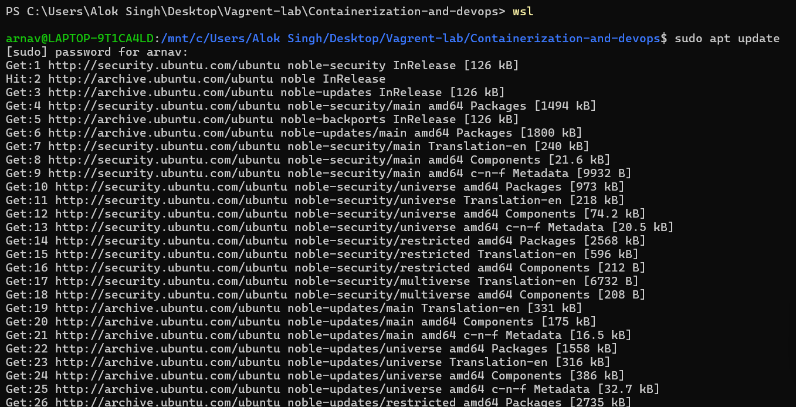
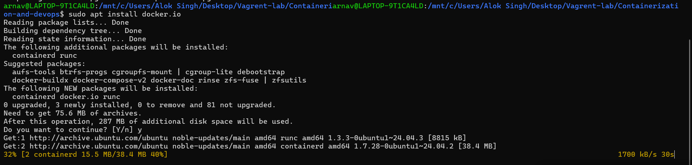
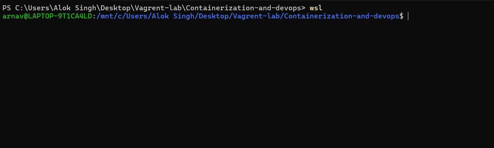
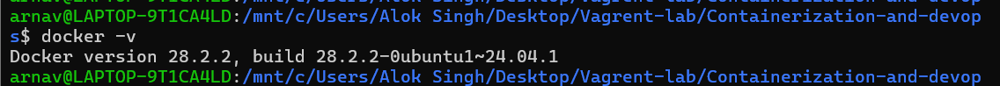

# 📘 Lecture – 21 Jan

> Course: Cloud Computing  
> Author: Arnav  
> Year: 2026  

---

## 📌 Overview

This lecture session covers the key concepts discussed on 21st January.  
The following screenshots document the practical steps and commands executed during the class.

---

## 🛠️ Environment Details

- OS: Windows 11  
- Tool Used: Linux / Vagrant / Docker  
- Version Used: (Mention if required)

---

## 📸 Lecture Screenshots

### 🔹 Screenshot 1

---

### 🔹 Screenshot 2

---

### 🔹 Screenshot 3

---

### 🔹 Screenshot 4

---

## ✅ Outcome

The lecture was completed successfully, and all commands were executed as demonstrated during the session.

---

## 📚 Key Learnings

- Understanding of basic cloud concepts  
- Practical command execution  
- System configuration and verification  
- Hands-on exposure to tools  

---

## 👨‍💻 Author

**Arnav**  
Cloud & DevOps Enthusiast 🚀