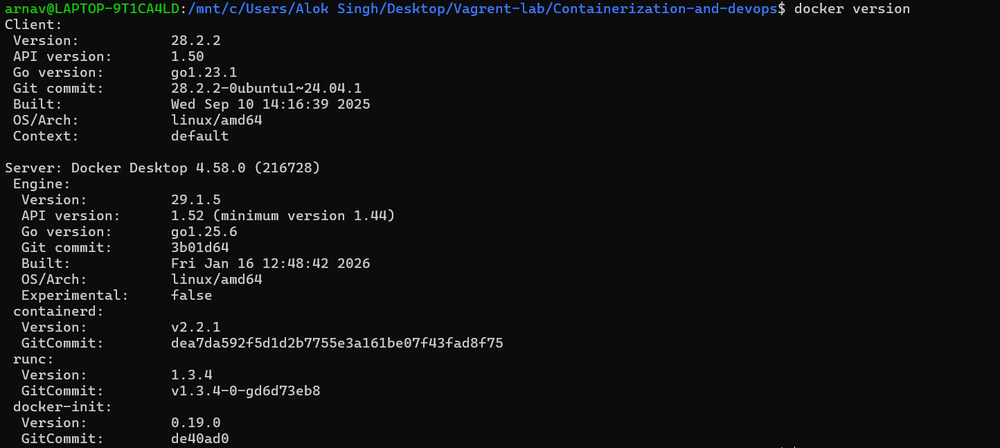
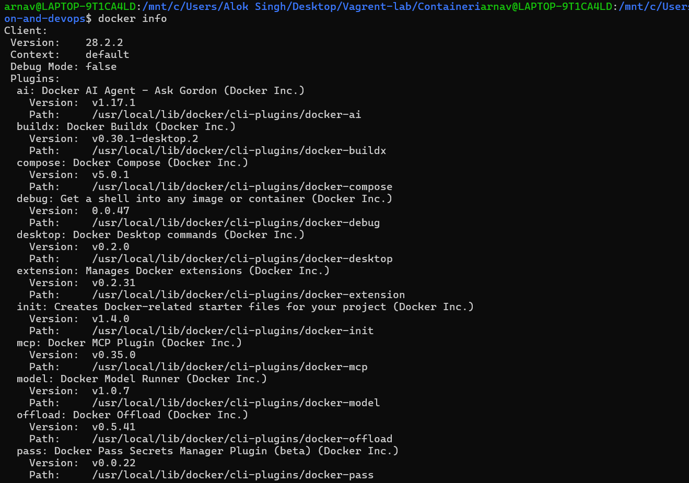
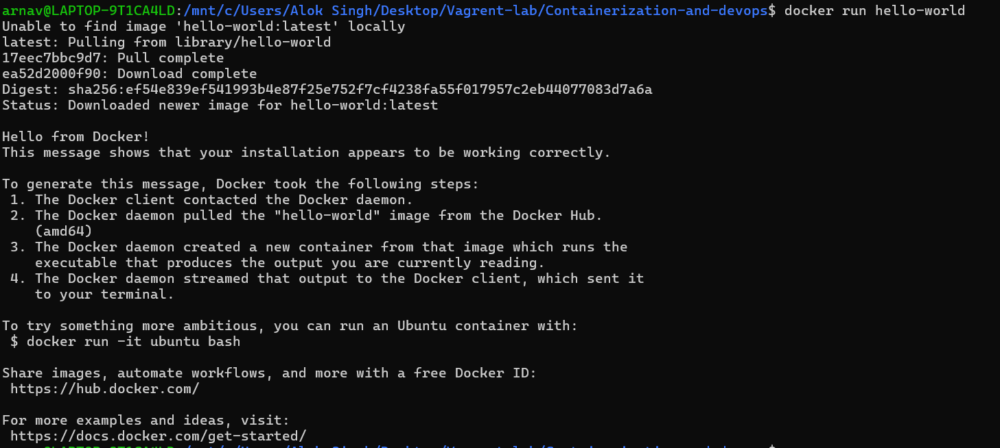
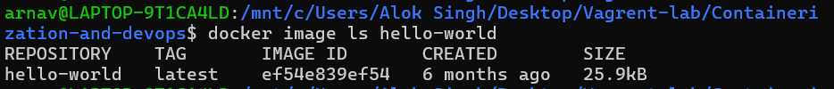
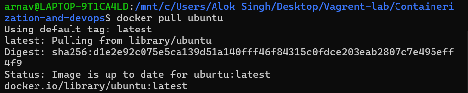
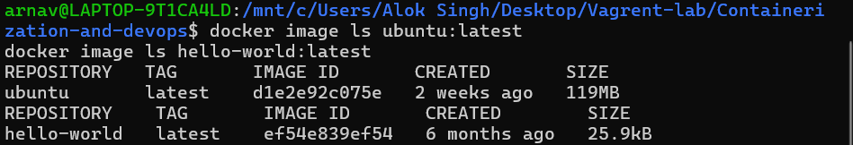

# 📘 Lecture – 22 Jan

> Course: Cloud Computing  
> Author: Arnav  
> Year: 2026  

---

## 📌 Overview

This lecture session conducted on 22nd January focuses on practical cloud concepts and system-level demonstrations.  
The screenshots below represent the step-by-step execution performed during class.

---

## 🛠️ Environment Details

- OS: Windows 11  
- Tool Used: Linux / Vagrant / Docker  
- Version Used: (Mention if applicable)

---

## 📸 Lecture Screenshots

### 🔹 Screenshot 1

---

### 🔹 Screenshot 2

---

### 🔹 Screenshot 3

---

### 🔹 Screenshot 4

---

### 🔹 Screenshot 5

---

### 🔹 Screenshot 6

---

## ✅ Outcome

The session was successfully completed and all practical steps were verified through command execution.

---

## 📚 Key Learnings

- Understanding system configuration  
- Command-line operations  
- Tool installation and verification  
- Practical exposure to cloud environment setup  

---

## 👨‍💻 Author

**Arnav**  
Cloud & DevOps Enthusiast 🚀