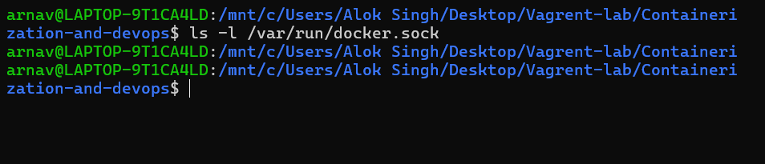
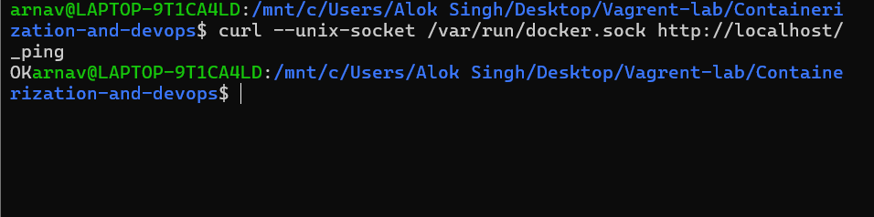
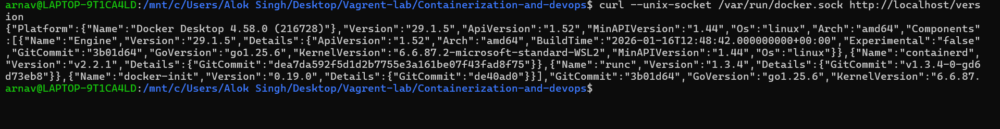
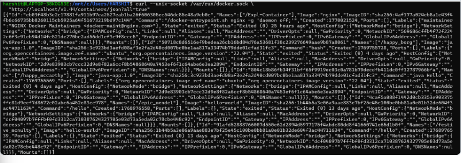
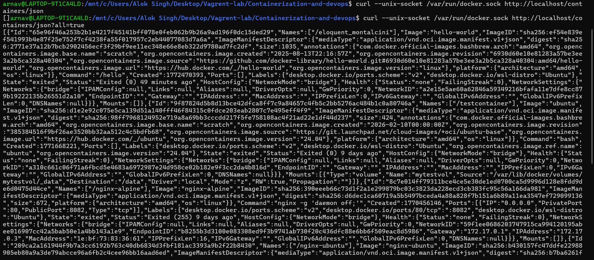
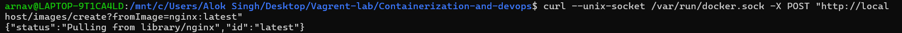

# 📘 Lecture – 3 Feb

> Course: Cloud Computing  
> Author: Arnav  
> Year: 2026  

---

## 📌 Overview

This lecture covers the foundational concepts discussed during the Cloud Computing session conducted on 3rd February.  
The screenshots below represent the practical demonstration and command execution performed during class.

---

## 🛠️ Environment Details

- OS: Windows 11  
- Tool Used: Vagrant / Linux  
- Version Used: Vagrant 2.4.9  

---

## 📸 Lecture Screenshots

### 🔹 Screenshot 1

---

### 🔹 Screenshot 2

---

### 🔹 Screenshot 3

---

### 🔹 Screenshot 4

---

### 🔹 Screenshot 5

---

### 🔹 Screenshot 6

---

## ✅ Outcome

The lecture session was successfully completed and all demonstrated commands executed without errors.

---

## 📚 Key Learnings

- Understanding of virtualization concepts  
- Introduction to Vagrant  
- Command-line usage and verification  
- Practical system configuration  

---

## 👨‍💻 Author

**Arnav**  
Cloud & DevOps Enthusiast 🚀