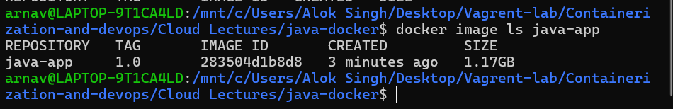
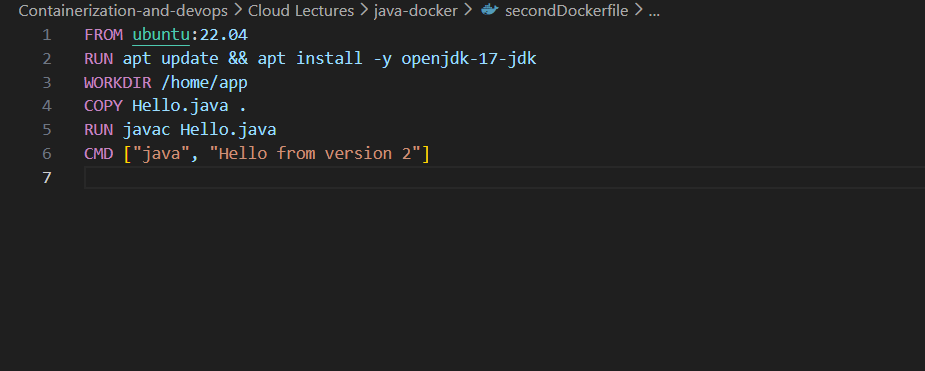
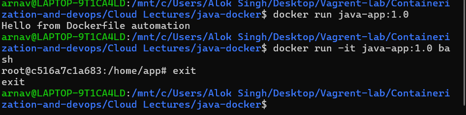
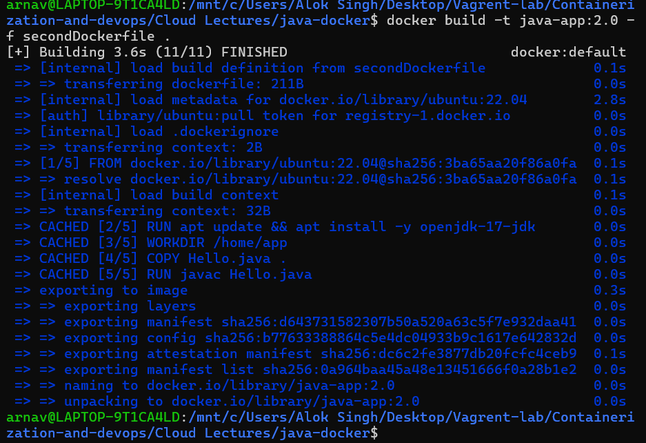
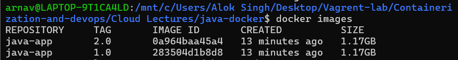
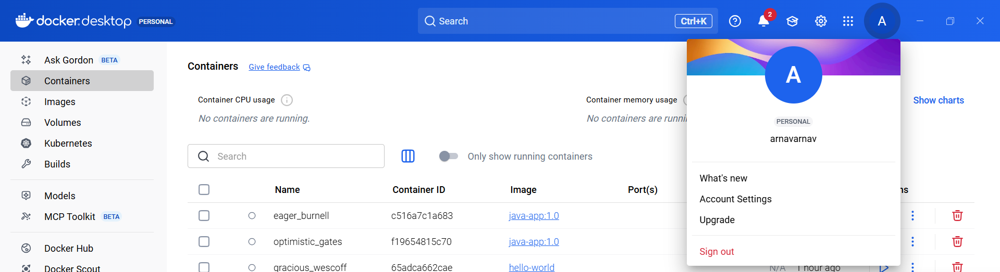
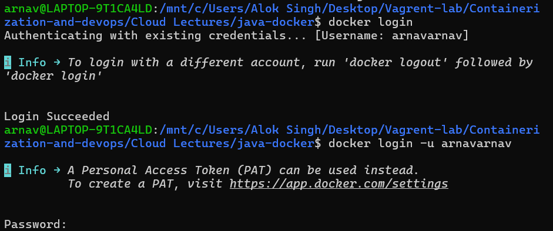
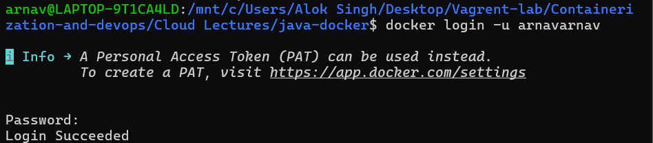

# 📘 Lecture – 30 Jan

> Course: Cloud Computing  
> Author: Arnav  
> Year: 2026  

---

## 📌 Overview

This lecture session held on 30th January focuses on practical cloud configuration and system-level demonstrations.  
The screenshots below show the step-by-step execution performed during the class.

---

## 🛠️ Environment Details

- OS: Windows 11  
- Tool Used: Linux / Vagrant / Docker  
- Version Used: (Mention if applicable)

---

## 📸 Lecture Screenshots

### 🔹 Screenshot 1

---

### 🔹 Screenshot 2

---

### 🔹 Screenshot 3

---

### 🔹 Screenshot 4

---

### 🔹 Screenshot 5

---

### 🔹 Screenshot 6

---

### 🔹 Screenshot 7

---

### 🔹 Screenshot 8

---

## ✅ Outcome

All practical demonstrations were successfully executed and verified.  
The session provided hands-on exposure to real-time command execution and environment setup.

---

## 📚 Key Learnings

- Practical configuration steps  
- Command verification process  
- Understanding cloud workflow  
- Hands-on experience with tools  

---

## 👨‍💻 Author

**Arnav**  
Cloud & DevOps Enthusiast 🚀